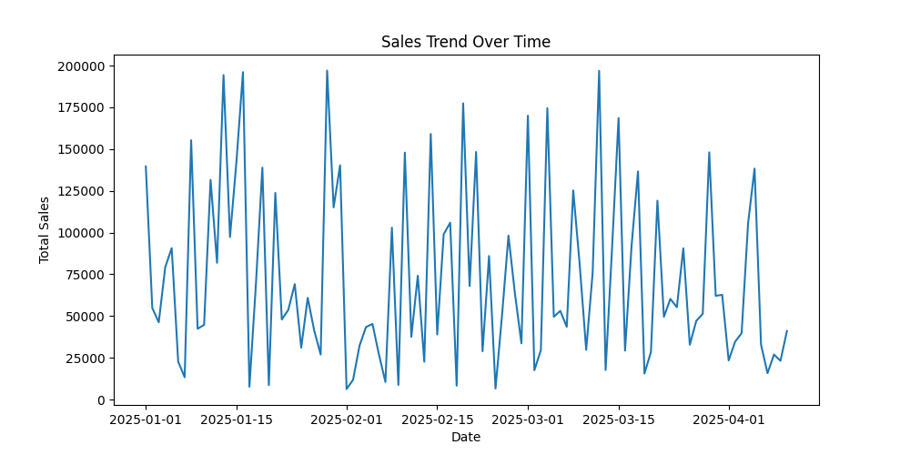
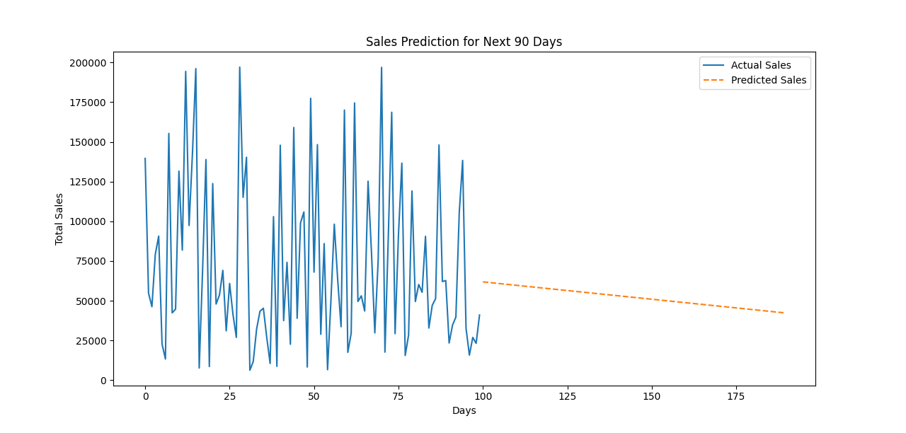

# 📊 Sales Data Analysis Project

This project analyzes **sales trends over 90 days** using Python, **pandas**, **seaborn**, and machine learning. It explores **sales distribution, trend analysis, and forecasts future sales** using **Linear Regression**.

## 🔹 Features
- 📈 **Sales Trend Analysis** – Visualize daily sales fluctuations
- 🛍️ **Product Performance** – Identify the top-selling products
- 🔮 **Sales Forecasting** – Predict future sales for **90 days**
- 🎨 **Data Visualizations** – Bar charts, line graphs, and pie charts

## 🏗️ Tech Stack
- **Python** (Core programming)
- **pandas** (Data manipulation)
- **numpy** (Numerical operations)
- **matplotlib & seaborn** (Data visualization)
- **scikit-learn** (Machine learning)

## ⚡ Installation & Setup
Clone the repository:
```powershell
git clone https://github.com/Yeshwanthnarva/Sales-Analysis.git
cd Sales-Analysis

Install dependencies:

```powershell
pip install pandas numpy matplotlib seaborn scikit-learn

Run the project:

```powershell
python sales_analysis.py

## 📷 Screenshots

### Sales Trend Visualization  


### Sales Prediction Chart  


🔍 How It Works
1. Data Generation
The dataset includes 100 days of sales data for products like Laptops, Mobiles, Tablets, and Headphones.

```python
np.random.seed(42)
data = {
    'Date': pd.date_range(start='2025-01-01', periods=100, freq='D'),
    'Product': np.random.choice(['Laptop', 'Mobile', 'Tablet', 'Headphones'], 100),
    'Quantity': np.random.randint(1, 5, size=100),
    'Price_per_unit': np.random.randint(5000, 50000, size=100)
}
df = pd.DataFrame(data)
df['Total_Sales'] = df['Quantity'] * df['Price_per_unit']

2. Data Analysis
df.describe() to see summary stats

Group sales per product:

```python
sales_per_product = df.groupby("Product")["Total_Sales"].sum()

3. Visualization
📊 Total Sales Per Product
```python
sns.barplot(x=sales_per_product.index, y=sales_per_product.values)
plt.title("Total Sales per Product")
plt.show()

📈 Sales Trends Over Time
```python
sns.lineplot(x=df["Date"], y=df["Total_Sales"])
plt.title("Sales Trend Over 90 Days")
plt.show()

4. Machine Learning: Sales Prediction
Linear Regression Model predicts sales for the next 90 days.

from sklearn.linear_model import LinearRegression

df["Days"] = np.arange(len(df)).reshape(-1, 1)
X = df[["Days"]]
y = df["Total_Sales"]

model = LinearRegression()
model.fit(X, y)

future_days = np.arange(len(df), len(df) + 90).reshape(-1, 1)
future_sales = model.predict(future_days)

📈 Sales Forecast Graph
sns.lineplot(x=df["Days"].values.flatten(), y=df["Total_Sales"], label="Actual Sales")
sns.lineplot(x=future_days.flatten(), y=future_sales, label="Predicted Sales", linestyle="dashed")
plt.title("Sales Prediction for Next 90 Days")
plt.legend()
plt.show()

⚡ Improvements & Next Steps
📊 Advanced Time-Series Forecasting (ARIMA, Prophet)

🏆 Customer Segmentation

🖥️ Dashboard (Streamlit) for Interactive Analysis